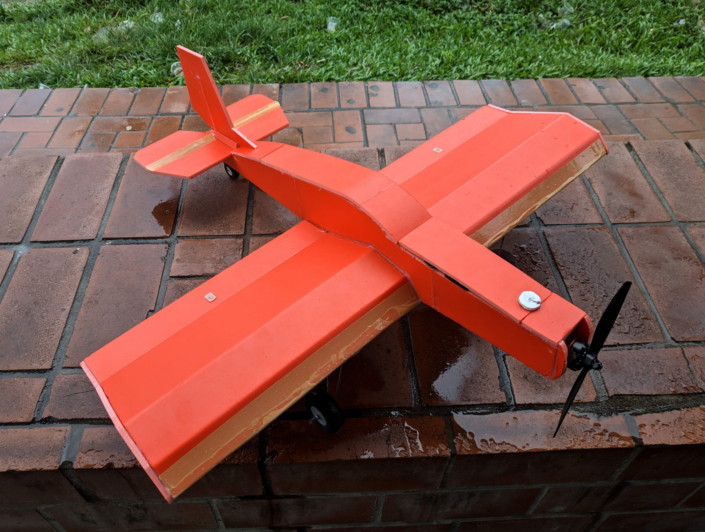
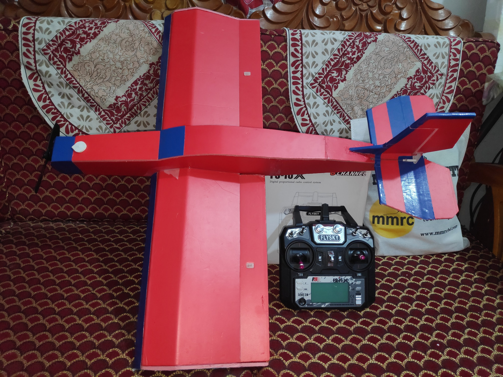

# ✈️ 4-Channel RC Plane

A **4-channel RC plane** built with thrust, aileron, elevator, and rudder controls. Controlled using a **FSI6x transmitter** and **IA6B receiver**, this project is perfect for learning **aerodynamics, flight dynamics, and RC electronics**.

---

## 📸 Project Images

Add your project images here:

<p align="center">
  
  
</p>

---

## 🛠️ Plane Parts & Accessories

- 🟢 Kraft foam board  
- 🎮 4 or 6 channel Transmitter and Receiver (FSI6x + IA6B)  
- ⚡ 2205 2000–2600 KV Brushless Motor  
- 🌀 Propellers  
- 🔌 30A Brushless ESC  
- 🔋 1000 mAh 11.1V LiPo Battery  
- ⚡ LiPo Battery Charger  
- 🔧 4 × 9g Servo Motors  
- 🔗 Pushrods & Horns  
- 🛞 Landing Gear Wheels  
- 🔌 Y Extension Cable  
- 🟡 3.5 mm Gold Connectors  
- 🟠 L-type Nylon Clevis Keeper  
- 🔌 XT60 Connectors  
- 🟣 Push Rod Stoppers  
- 🪵 Balsa Wood  
- 🔥 Glue Gun  
- ✂️ Anti Cutter  
- 🗡️ Hobby Knife  

---

## 🚀 Features

- 🕹️ Manual flight control with 4 channels: Thrust, Aileron, Elevator, Rudder  
- ⚖️ Optimized center of gravity and aerodynamics after iterative testing  
- ✅ Stable flight achieved after troubleshooting initial unsuccessful attempts  

---

## 📘 Learnings

- 🔌 RC electronics and servo integration  
- ⚡ Brushless motor setup and ESC calibration  
- 🌬️ Flight dynamics and aerodynamics  
- 🧠 Problem-solving through iterative testing and adjustments  

---

## ⚙️ Setup

1. 🛠️ Assemble all plane parts and ensure proper CG.  
2. 🔗 Connect servos, ESC, and motor to the receiver.  
3. 🎮 Bind transmitter (FSI6x) to receiver (IA6B).  
4. 🔋 Charge LiPo battery and connect via XT60.  
5. ✅ Test control surfaces and motor in a safe area before first flight.  


 

---

## 📁 Repository Structure
```
RC-Plane/
├── Images/       # Project photos
├── Circuits/     # Wiring diagrams (if any)
├── README.md     # Project overview
└── Notes/        # Flight logs and learnings
```


---

**👤 Author:** Niloy Sannyal  
**📍 Location:** Dhaka, Bangladesh  
**✉️ Contact:** niloysannyal@gmail.com


